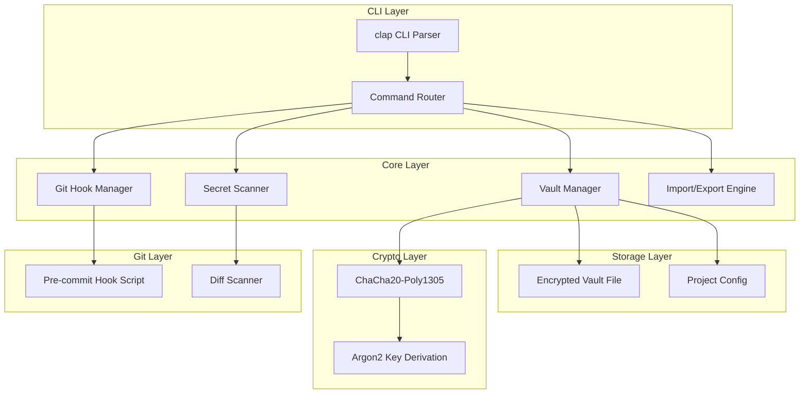

## 产品概述

devvault 是一个面向开发者的密钥/环境变量管理 CLI 工具，旨在解决 .env 文件散落、密钥泄漏等常见安全问题。它将环境变量管理与安全扫描功能合二为一，填补 dotenvx（只管加密）和 trufflehog（只管扫描）之间的空白。

## 核心功能

- **统一管理环境变量**：通过 CLI 命令集中管理所有项目的环境变量，支持 set/get/list/remove 操作
- **加密存储**：使用 AEAD 加密算法（ChaCha20-Poly1305）+ Argon2 密钥派生，将密钥加密存储在 `.devvault/vault.enc` 文件中
- **安全扫描**：自动扫描代码仓库中的硬编码密钥（API Key、Token、密码等），支持正则模式匹配和高亮输出
- **导入/导出 .env**：支持从标准 `.env` 文件导入变量，也能导出为 `.env` 格式供应用使用
- **Git Pre-commit Hook**：自动安装 git hook，在提交前扫描变更文件，阻止包含硬编码密钥的提交
- **团队共享**：加密后的 vault 文件可安全提交到 git 仓库，团队成员通过共享密码或密钥文件解密
- **单二进制分发**：编译为单一可执行文件，无需运行时依赖，跨平台支持 Windows/macOS/Linux

## 技术栈选择

- **语言**：Rust (Edition 2021)
- **CLI 框架**：clap v4（derive 宏模式，类型安全的命令行解析）
- **加密**：chacha20poly1305（AEAD 高性能加密）+ argon2（密码派生密钥，抗暴力破解）
- **序列化**：serde + serde_json（vault 数据格式）
- **配置**：toml（项目配置文件）
- **正则扫描**：regex（密钥模式匹配）
- **文件遍历**：walkdir（递归扫描目录）
- **Git 集成**：git2（libgit2 Rust 绑定，操作 git 仓库和 hooks）
- **编码**：base64（vault 文件编码）
- **错误处理**：anyhow（应用级）+ thiserror（库级自定义错误）
- **终端美化**：colored（彩色输出）+ indicatif（进度条）
- **构建/发布**：cargo + cross（跨平台编译）

## 实现方案

### 系统架构



### 模块划分

| 模块 | 职责 | 关键文件 |
| --- | --- | --- |
| `cli` | 命令行参数定义与解析 | `src/cli.rs` |
| `vault` | 环境变量 CRUD、加密/解密管理 | `src/vault.rs` |
| `crypto` | 加密算法封装、密钥派生 | `src/crypto.rs` |
| `scanner` | 硬编码密钥扫描引擎 | `src/scanner.rs` |
| `hooks` | Git pre-commit hook 安装与脚本生成 | `src/hooks.rs` |
| `export` | .env 文件导入/导出 | `src/export.rs` |
| `config` | 项目配置管理 | `src/config.rs` |
| `error` | 统一错误类型定义 | `src/error.rs` |


### 数据流

1. **存储流程**：用户输入密码 → Argon2 派生 256-bit 密钥 → ChaCha20-Poly1305 加密 JSON vault → Base64 编码写入 `vault.enc`
2. **读取流程**：读取 `vault.enc` → Base64 解码 → 用户输入密码 → Argon2 派生密钥 → 解密 → 返回 JSON
3. **扫描流程**：遍历目录文件 → 逐文件正则匹配密钥模式 → 输出匹配位置和类型
4. **Hook 流程**：安装时生成 shell/batch 脚本到 `.git/hooks/pre-commit` → 提交时自动运行 `devvault scan --staged`

### CLI 命令设计

```
devvault init                    # 初始化项目 vault
devvault set <KEY=VALUE>         # 设置环境变量
devvault get <KEY>               # 获取环境变量
devvault list                    # 列出所有变量
devvault remove <KEY>            # 删除变量
devvault import <FILE>           # 从 .env 文件导入
devvault export [--format env]   # 导出为 .env 格式
devvault scan [PATH]             # 扫描硬编码密钥
devvault hook install            # 安装 git pre-commit hook
devvault hook uninstall          # 卸载 git pre-commit hook
```

### 加密方案

- **算法**：ChaCha20-Poly1305 (IETF, 96-bit nonce)
- **密钥派生**：Argon2id (memory=64MB, iterations=3, parallelism=4)
- **Salt**：随机 16 字节，存储在 vault 文件头部
- **Nonce**：随机 12 字节，每次加密重新生成
- **Vault 文件格式**：`[salt:16][nonce:12][ciphertext+tag]`

### 密钥扫描规则

预置常见密钥模式：

- AWS Access Key (`AKIA[0-9A-Z]{16}`)
- GitHub Token (`gh[pousr]_[A-Za-z0-9_]{36,}`)
- Generic API Key (`[Aa][Pp][Ii][-_]?[Kk][Ee][Yy].*['\"][0-9a-zA-Z]{32,}['\"]`)
- Private Key (`-----BEGIN (RSA |EC |OPENSSH )?PRIVATE KEY-----`)
- JWT Token (`eyJ[A-Za-z0-9-_]+\.eyJ[A-Za-z0-9-_]+\.[A-Za-z0-9-_.+/=]+`)
- Generic Secret (`[Ss]ecret[-_]?[Kk]ey.*['\"][0-9a-zA-Z]{16,}['\"]`)
- Database URL (`(mysql|postgres|mongodb)://[^\s]+`)

### 性能与安全考量

- **性能**：扫描使用多线程（rayon），大仓库扫描复杂度 O(n*m)，n=文件数，m=平均文件大小；加密使用硬件加速（ChaCha20 在无 AES-NI 的设备上更快）
- **安全**：密码不落盘，仅在内存中存在；vault 解密后内存及时清零（使用 `zeroize` crate）；nonce 每次加密随机生成避免重放
- **兼容性**：Windows/macOS/Linux 三平台，Git Bash/CMD/PowerShell 均支持

## 目录结构

```
d:\devvault\
├── Cargo.toml                    # [NEW] 项目配置，定义依赖和元数据
├── Cargo.lock                    # [NEW] 依赖锁定文件
├── src/
│   ├── main.rs                   # [NEW] 程序入口，初始化 CLI 并分发命令
│   ├── cli.rs                    # [NEW] CLI 命令和参数定义（clap derive）
│   ├── vault.rs                  # [NEW] Vault 核心逻辑：加载/保存/增删改查环境变量
│   ├── crypto.rs                 # [NEW] 加密/解密封装：ChaCha20-Poly1305 + Argon2
│   ├── scanner.rs                # [NEW] 密钥扫描引擎：正则匹配、多线程扫描、结果输出
│   ├── hooks.rs                  # [NEW] Git hook 管理：安装/卸载 pre-commit 脚本
│   ├── export.rs                 # [NEW] .env 文件导入/导出：解析和生成 .env 格式
│   ├── config.rs                 # [NEW] 项目配置：.devvault/config.toml 读写
│   └── error.rs                  # [NEW] 统一错误类型定义（thiserror）
├── .devvault/                    # [NEW] 运行时生成的项目 vault 目录（示例/测试用）
│   ├── vault.enc                 # 加密的 vault 文件
│   └── config.toml               # 项目配置
├── tests/
│   ├── integration_test.rs       # [NEW] 集成测试：端到端命令测试
│   └── scanner_test.rs           # [NEW] 扫描器单元测试：验证各密钥模式匹配
└── README.md                     # [NEW] 项目文档：安装、使用、贡献指南
```

## 关键代码结构

### CLI 命令枚举 (cli.rs)

```rust
#[derive(Parser)]
#[command(name = "devvault", about = "Developer secrets & .env manager")]
pub struct Cli {
    #[command(subcommand)]
    pub command: Commands,
}

#[derive(Subcommand)]
pub enum Commands {
    Init,
    Set { key_value: String },
    Get { key: String },
    List,
    Remove { key: String },
    Import { file: PathBuf },
    Export { #[arg(long, default_value = "env")] format: String },
    Scan { path: Option<PathBuf> },
    Hook { #[command(subcommand)] action: HookAction },
}
```

### Vault 数据结构 (vault.rs)

```rust
#[derive(Serialize, Deserialize)]
pub struct Vault {
    pub version: u32,
    pub variables: BTreeMap<String, VaultEntry>,
    pub created_at: String,
    pub updated_at: String,
}

#[derive(Serialize, Deserialize)]
pub struct VaultEntry {
    pub value: String,
    pub added_at: String,
    pub source: Option<String>,
}
```

### 加密接口 (crypto.rs)

```rust
pub fn derive_key(password: &[u8], salt: &[u8]) -> Result<[u8; 32]>;
pub fn encrypt(plaintext: &[u8], key: &[u8; 32]) -> Result<Vec<u8>>;
pub fn decrypt(ciphertext: &[u8], key: &[u8; 32]) -> Result<Vec<u8>>;
```

## Agent Extensions

### SubAgent

- **code-explorer**
- Purpose: 在实现过程中探索 Rust 生态中 clap、chacha20poly1305、argon2、git2 等 crate 的 API 用法和最佳实践
- Expected outcome: 获得准确的 API 调用方式和惯用模式，确保代码实现正确